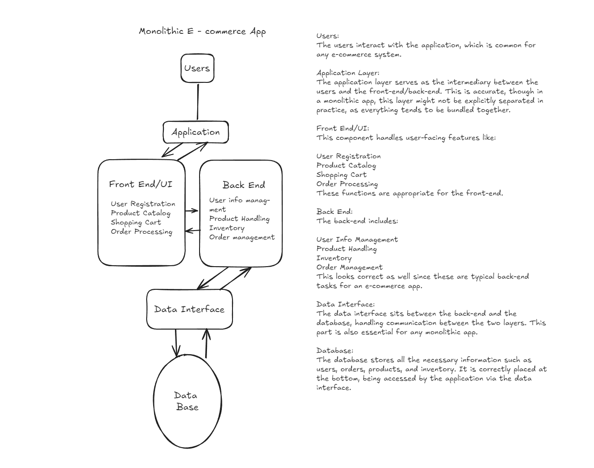
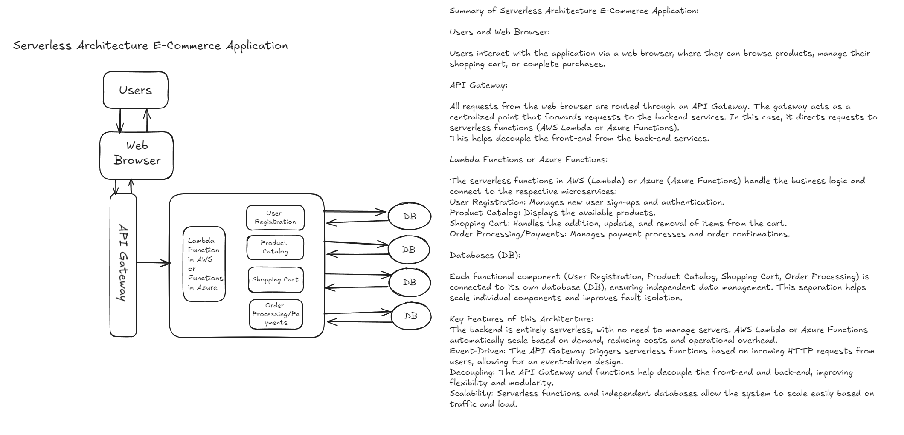

# Week 3: System Design Applications

This week, we focused on comparing three different architectural styles: **Monolithic**, **Microservices**, and **Serverless**. We evaluated them based on key criteria such as scalability, development complexity, deployment, maintenance, and cost implications. Below is a detailed comparison, along with the suitability of each architecture for different types of projects.

## Comparison of Architectural Styles

### 1. **Monolithic Architecture**
- **Scalability**: Primarily vertical scaling. It is more difficult to scale horizontally as the entire application must be scaled together.
- **Development Complexity**: Simple to develop initially, but becomes complex as the codebase grows and all components are tightly coupled.
- **Deployment**: Requires redeploying the entire application even for minor updates.
- **Maintenance**: Maintenance becomes difficult as the application grows due to tight coupling between components.
- **Cost Implications**: Lower upfront costs but higher infrastructure costs when scaling due to the limitations of vertical scaling.

**Best For**: 
- Small-scale projects with stable and predictable traffic.
- Applications with low complexity where development speed is the priority.

---

### 2. **Microservices Architecture**
- **Scalability**: Highly scalable through horizontal scaling. Each microservice can scale independently based on demand.
- **Development Complexity**: Complex to develop and manage, as it requires careful handling of inter-service communication, data consistency, and failure points.
- **Deployment**: Supports independent deployments for each microservice, which allows for faster and incremental updates.
- **Maintenance**: Easier to maintain than monolithic applications due to service isolation, but requires strong monitoring and logging.
- **Cost Implications**: More cost-efficient than monolithic in terms of scaling, but higher initial development costs due to the need for a distributed system setup.

**Best For**:
- Large-scale applications with high complexity.
- Projects with variable traffic loads and frequent updates.

---

### 3. **Serverless Architecture**
- **Scalability**: Automatically scales based on demand with no manual intervention required. Functions scale dynamically in response to events.
- **Development Complexity**: Simple to develop since infrastructure is abstracted away, but managing state and data persistence can add complexity.
- **Deployment**: Quick and easy to deploy functions independently, making it ideal for continuous delivery.
- **Maintenance**: Minimal, as the infrastructure is fully managed by the cloud provider. 
- **Cost Implications**: Very cost-efficient for applications with variable or sporadic traffic, as you only pay for the resources consumed.

**Best For**:
- Small to medium-scale projects with variable or unpredictable loads.
- Applications requiring rapid development and deployment with minimal infrastructure management.

---

## Comparison Table

| Feature                | Monolithic               | Microservices            | Serverless              |
|------------------------|--------------------------|--------------------------|-------------------------|
| **Scalability**         | Vertical, limited        | Horizontal, efficient     | Auto-scaling, dynamic    |
| **Development Complexity** | Simple at first, complex with growth | Complex, requires expertise | Simple, but statelessness can add complexity |
| **Deployment**          | Single unit              | Independent deployments   | Independent function deployments |
| **Maintenance**         | Complex, especially with growth | Easier, but requires monitoring | Minimal, managed by cloud provider |
| **Cost**                | Higher at scale          | More cost-efficient scaling | Pay-per-use, cost-efficient for variable loads |
| **Best For**            | Small, stable projects   | Large, complex projects   | Small to medium projects with variable loads |

---

## Conclusion
- **Monolithic Architecture** is ideal for small-scale, low-complexity projects where development speed is crucial and scalability needs are minimal.
- **Microservices Architecture** is best suited for large-scale, complex applications that require independent scaling and flexibility.
- **Serverless Architecture** excels in handling variable traffic loads and minimizing infrastructure management, making it cost-effective for smaller projects with unpredictable workloads.

Each architectural style has its strengths and weaknesses, and the right choice depends on the size, complexity, and traffic patterns of the application.

---

